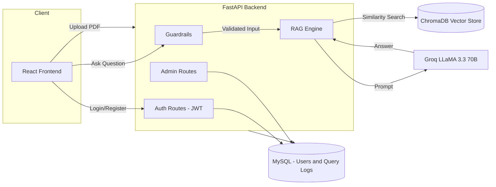

# DocMind — RAG Assistant with Role-Based Access Control

DocMind is a full-stack Retrieval-Augmented Generation (RAG) application that lets users upload PDF documents and ask natural-language questions about their contents. It combines a FastAPI backend, a Chroma vector store, and the Groq LLaMA API for answer generation, wrapped in JWT authentication and a three-tier role-based access control (RBAC) system (`employee`, `manager`, `admin`). The system includes input/output guardrails, an admin monitoring dashboard, and Docker support for deployment.

## Features

- **Document Q&A (RAG)** — Upload PDFs, which are chunked, embedded with `sentence-transformers/all-MiniLM-L6-v2`, and stored in a Chroma vector database. Questions are answered using semantic similarity search combined with the Groq-hosted `llama-3.3-70b-versatile` model.
- **JWT Authentication** — Email/password registration and login using `bcrypt` password hashing and signed JWTs (`python-jose`).
- **Role-Based Access Control** — Three roles with distinct permissions:
  | Role | Upload Docs | Delete Docs | Ask Questions | Manage Users | View Logs |
  |---|---|---|---|---|---|
  | Employee | ❌ | ❌ | ✅ | ❌ | ❌ |
  | Manager | ✅ | ❌ | ✅ | ❌ | ❌ |
  | Admin | ✅ | ✅ | ✅ | ✅ | ✅ |
- **Guardrails**
  - **Input validation** — blocks overly long inputs and known prompt-injection patterns (e.g. "ignore previous instructions", "jailbreak", "DAN mode").
  - **Context-grounded answers** — the LLM is strictly prompted to answer only from retrieved document context, with a fixed fallback response when the answer isn't found.
  - **PII redaction** — responses are scanned for emails, phone numbers, Aadhaar numbers, PAN numbers, and credit card numbers, which are automatically redacted before being returned.
- **Admin Dashboard**
  - User management with inline role switching.
  - Live query log feed with guardrail violation flags.
  - Aggregate stats: total queries, average response time, guardrail violations, average chunks retrieved.
- **Modern Chat UI** — React single-page app with drag-and-drop PDF upload, live document indexing status, typing indicators, and a backend health indicator.
- **Containerized Frontend** — multi-stage Docker build (Node → Nginx) for production-ready static serving.

## Tech Stack

**Backend:** FastAPI, SQLAlchemy, MySQL, Pydantic, python-jose (JWT), bcrypt, LangChain, ChromaDB, HuggingFace `sentence-transformers`, Groq API (LLaMA 3.3 70B)

**Frontend:** React 18 (Create React App), Tabler Icons, DM Sans / DM Serif Display (Google Fonts)

**Infra:** Docker, Nginx

## System Architecture




## Project Structure

```
RAG_RBAC_Project/
├── app.py                  # FastAPI app & route definitions
├── auth.py                 # Password hashing & JWT helpers
├── database.py              # SQLAlchemy engine/session setup
├── dependencies.py          # get_current_user / require_role guards
├── guardrails.py            # Input/output guardrails
├── ingest.py                 # PDF chunking & vector store ingestion
├── rag.py                   # Retrieval + Groq LLM answer generation
├── models.py                # User & QueryLog ORM models
└── routes/
    └── auth_routes.py       # /auth/register, /auth/login

frontend/
├── Dockerfile               # Multi-stage build (Node → Nginx)
├── nginx.conf
├── public/index.html
└── src/
    ├── App.jsx               # Root app, state & API orchestration
    └── components/
        ├── AuthScreen.jsx     # Login / Register
        ├── Sidebar.jsx        # Upload, docs list, admin tabs
        ├── ChatInput.jsx
        ├── Message.jsx
        ├── WelcomeScreen.jsx
        ├── UserPanel.jsx       # Admin: role management
        └── LogsPanel.jsx       # Admin: monitoring dashboard
```

## Getting Started

### Prerequisites

- Python 3.10+
- Node.js 18+
- MySQL server
- A running ChromaDB server (see [Docker](#docker) below)
- A [Groq API key](https://console.groq.com)

### Backend Setup

1. Install dependencies:
   ```bash
   pip install fastapi uvicorn sqlalchemy pymysql python-dotenv bcrypt "python-jose[cryptography]" \
               langchain langchain-community langchain-text-splitters langchain-huggingface \
               langchain-chroma chromadb langchain-groq
   ```
2. Create a `.env` file in the backend root:
   ```env
   SECRET_KEY=your-secret-key
   MYSQL_USER=root
   MYSQL_PASSWORD=yourpassword
   MYSQL_HOST=localhost
   MYSQL_DB=docmind
   CHROMA_HOST=localhost
   CHROMA_PORT=8001
   GROQ_API_KEY=your-groq-api-key
   ```
3. Start the API server:
   ```bash
   uvicorn app:app --reload
   ```
   The API will be available at `http://localhost:8000`.

### Frontend Setup

```bash
cd Frontend
npm install
npm start
```

The app runs at `http://localhost:3000` and expects the backend at `http://localhost:8000` (configured via the `API` constant in each component).

### Docker

The frontend ships with a production Dockerfile (Node build → Nginx serve):

```bash
cd Frontend
docker build -t docmind-frontend .
docker run -p 3000:80 docmind-frontend
```

ChromaDB should be run as its own container so the backend can connect via `chromadb.HttpClient`:

```bash
docker run -d -p 8001:8000 --name chroma chromadb/chroma
```
---
## Screenshots

### Login page


### Employee page


### Manager page(Upload PDFs only)


### Admin page (Upload/Remove PDFs)
.png)

### Admin page (View the users)
.png)

### Admin page (Dashboard)
.png)

---
## API Reference

| Method | Endpoint | Access | Description |
|---|---|---|---|
| POST | `/auth/register` | Public | Register a new user (default role: `employee`) |
| POST | `/auth/login` | Public | Authenticate and receive a JWT |
| GET | `/files` | Authenticated | List indexed documents |
| POST | `/upload` | Authenticated | Upload & ingest a PDF |
| DELETE | `/delete/{filename}` | Admin | Delete an indexed document |
| POST | `/chat` | Authenticated | Ask a question (RAG + guardrails) |
| GET | `/admin/users` | Admin | List all users |
| PATCH | `/admin/users/{id}/role` | Admin | Update a user's role |
| GET | `/admin/logs` | Admin | Recent query logs |
| GET | `/admin/logs/stats` | Admin | Aggregate usage stats |

## Notable Design Decisions

- **Strict context grounding** — the LLM prompt explicitly forbids using outside knowledge and returns a fixed fallback message when no relevant context is retrieved, reducing hallucination.
- **Defense in depth** — guardrails run on both the input (length, prompt-injection regex checks) and the output (PII pattern redaction), independent of the LLM's own behavior.
- **Self-role-change protection** — admins are blocked from changing their own role via the API to prevent accidental lockout.
- **Observability by default** — every chat request, including guardrail-blocked ones, is logged with response time and chunk count for the admin dashboard.

## Future Improvements


- Move hardcoded API URLs to environment variables for multi-environment deployment.
- Add automated tests for guardrails and RBAC permission boundaries.

--- 
## Developed By

Karthik Aravind M
